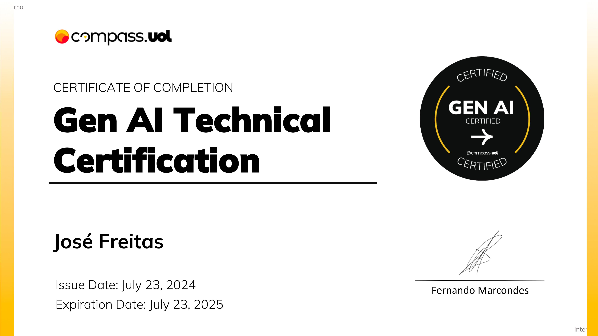

# Certifications

<h1 align="center">
  
Gen AI Technical

  
</h1>

<h1 align="center">
  
AI Agent Engineer Certification

  
</h1>

<h1 align="center">
  
AI Assisted Certified Professional

  
</h1>

<h1 align="center">
  
Adobe Commerce: Sales Accreditation (P)

  
</h1>

<h1 align="center">
  
Masterclass | algoritmos de machine learning

  
</h1>

<h1 align="center">
  
NodeJS and MongoDB developer

  
</h1>

<h1 align="center">
  
Go(Golang) explorando a linguagem do google

  
</h1>

<h1 align="center">
  
PHP do zero a maestria

  
</h1>

<h1 align="center">
  
The complete Github Actions & Workflows

  
</h1>
